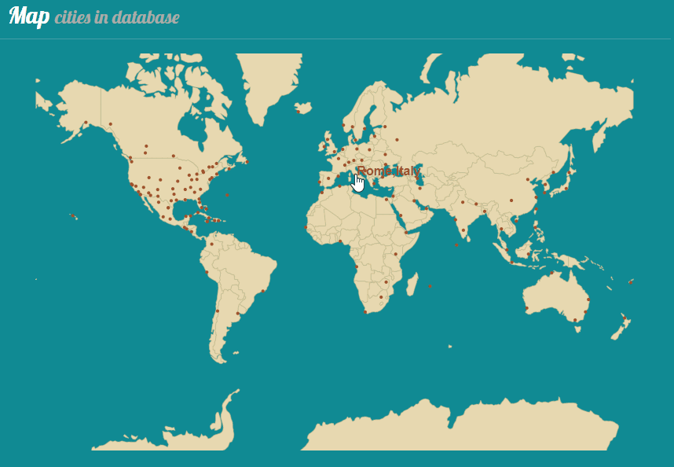

## the WeatherDB - A weather database for cities around the world

The WeatherDB is a data visualization application for historical weather data. New data is collected daily from a third-party API (AerisWeather) and saved in the data base. These statistics currently include daily max/min temperature, UV index, precipitation. This data visualization tool helps to identify trends in weather data due to climate change, which may be affecting some areas of the world differently from others. 

### Features
* World map of all cities in database; city name label appears when mouse moves over the circle it presents

  

* Link to different weather data graphs for each city
* Daily updates of weather data

### Future work
* Draggable world map in orthographic projection
* Scrollbar to select interval to display
* Comparison of multiple cities' data in one graph

### Development server
Run `ng serve` for a dev server. Navigate to `http://localhost:4200/`. The app will automatically reload if you change any of the source files.

