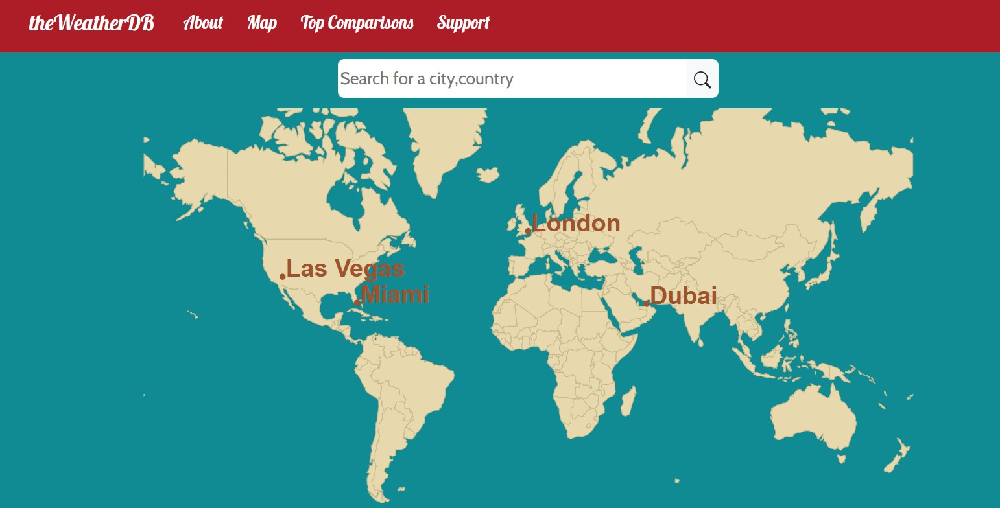
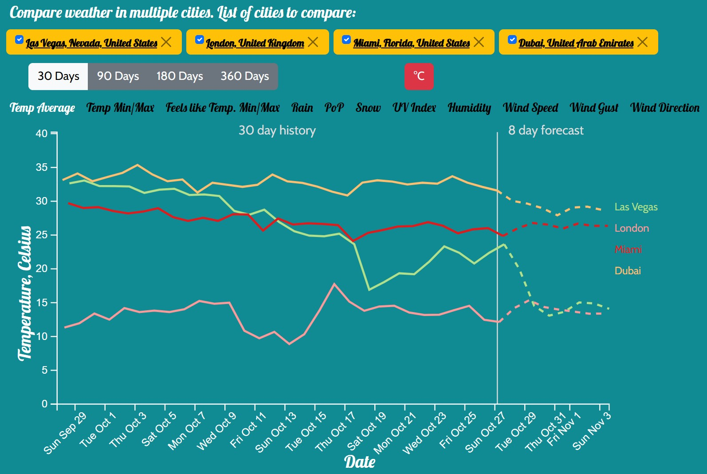

## the WeatherDB - A weather database for cities around the world

The WeatherDB is a data visualization application for weather history and forecast data. New data is collected daily from a third-party API (AerisWeather) and saved in the database. These statistics currently include daily max/min temperature, UV index, precipitation. This data visualization tool helps to identify trends in weather data due to climate change, which may be affecting some areas of the world differently from others. The same graphs can be used to visualize other time-series data.

### Features
* Search and select multiple cities for weather comparison
* Link to different weather data for each city
* One tab for each weather statistic graph
* Daily updates of weather data

  

  

### Future work
* Draggable world map in orthographic projection
* Scrollbar to select date interval to display

### Development server
Note: publicly available source is not the version running on web server (www.theweatherdb.com).
Run `ng serve` for a dev server. Navigate to `http://localhost:4200/`. The app will automatically reload if you change any of the source files.